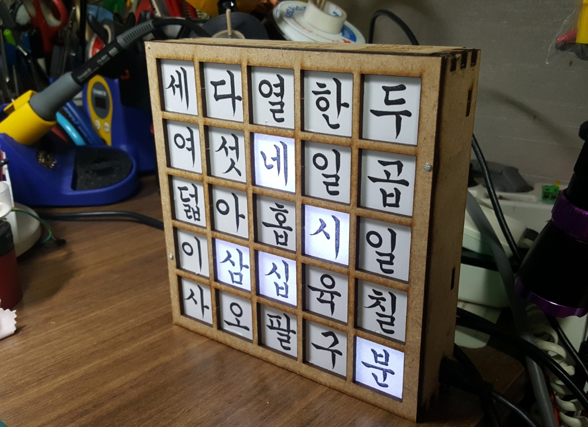

	 한글시계 design based on attiny44a.
	2018. 6. 28 ~ 2018. 7. 24

	Software, schemetic, PCB file created by PARK JONG SEOK (박종석)

	Case CAD file Created by Choi Yun Shick (최윤식) 

	NO LICENCE INCLUDED
	Contact cakeng@naver.com to
	use, modify, or share the software, schemetic, PCB for any purpose
	other than personal use.

	
	//EDIT
	The project is being updated to the newly released Attiny816 version as of 2018.11.28.
	The current PCB file is using Attiny4313, and the codes are based on the Attiny44.
	
